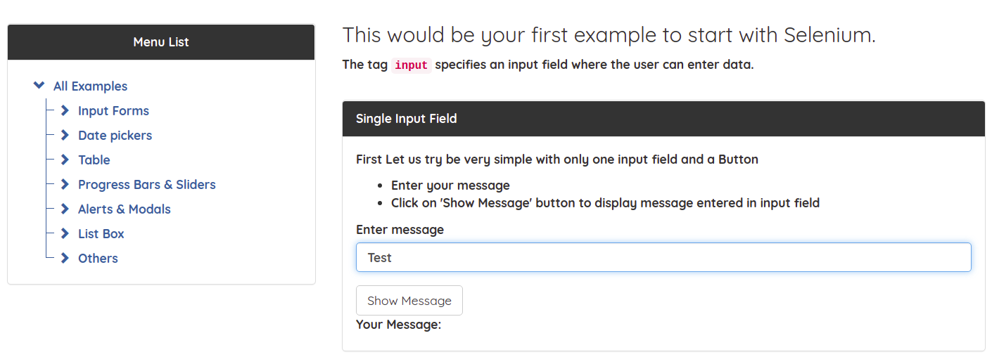

# Testing the browser
This project was created to learn how to build robust and maintainable automation solutions. The task was to create all test cases in with Selenium Webdriver and the implementation of POM, KDT and DDT



Test cases were created for the following features in both POM and KDT

- Navigation
- Single field & Button
- Two fields & Output
- Checkbox
- Select List
- Radio Buttons

## Tasks

First exercise - Navigation:<br>
- Open the base url. Using the "Menu List" navigate to All Examples/Input Forms/Simpe Form Demo
- Base url: https://www.seleniumeasy.com/test/
- Extension: Create reusable navigation keyword (and reuse it :])

Second exercise - Single field & Button:<br>
- Navigate to Simpe Form Demo. In "Single Input Field" enter a message into the field and click "Show Message" button. Validate that the message appeared.
- Extension: fill the field data-driven way, use a source file for it

Third exercise - Two fields & Output:<br>
- Navigate to Simpe Form Demo. In "Two Input Fields" enter value A and B and click the "Get Total" button. Validate that the answer is correct.
- Does your test works even when you enter very large numbers?
- Extension: use at least 5 rows from data source with expected results, make positive and negative tests (1, a, expected 1a - failing test)

Fourth exercise - Checkbox:<br>
- Navigate to Checkbox Demo. In "Single Checkbox Demo" check the checkbox and validate the message.
- Bonus if you write a test for "Multiple Checkbox Demo" and find the bug which is present on the webpage.
- Extension: create a data source with at least 5 rows, with input combinations for checkbox (something like 1,0,1,0 should tick the 2nd and 4th checkboxes), dont forget validations

Fifth exercise - Select List:<br>
- Navigate to Select Dropdown List. In "Select List Demo" select the current day from the dropdown and validate that it's selected.
- Try out all the way you can select a day.
- Extension: select each days after each other twice (14 in total), use keywords and data source obviously

Sixth exercise - Radio Buttons:<br>
- Navigate to Radio buttons Demo. In "Group Radio Buttons Demo" select a combination and click the "Get values" 
button. Validate the result.<br>
- Try to run several combinations in one test.<br>
- Extension: create and validate all possible combinations once, use data source and keywords<br>

## Technical Information and requirements
The tests were run using the following versions:
```text
Project SDK: java 11 version 11.09
Google Chrome: Version 91.0.4472.77 (64-bit)
ChromeDriver: Version 91.0.4472.101
```

If you are using a different version of Google Chrome you need to download the matching ChromeDriver version from https://chromedriver.chromium.org/downloads and replace the ChromeDriver in the project directory.
